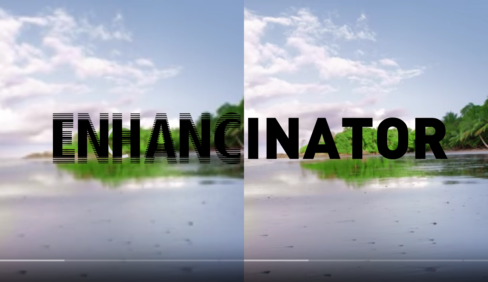

  

# AMBiguouS

This repository contains codes and demonstrations of our project that was completed during InOut 7.0 2020.

## Problem

We all live in the 21st Century, a place, a time where we all are completely dependent on the internet but we all face one most comman problem, that is internet connectivity and the availability. People in the rural areas and well as many people in cities and towns have limited data, face an issue of low bandwidth and poor connection and hence are not able to reap the benefits of internet. In today's world videos are a major source of information be it in the domain of education, news, sports and everything thing that one can think of. Comprehending a video in low quality is a really tough job and destroys the user's video streaming experience. 

* Unavailability or bad network quality at many places.

* Since online video streaming is a major source of entertainment and information, watching videos in a bad quality is often useless as most of the details will not be visible, hence it becomes a necessity to stream videos in good quality. 

* In today's world, where COVID-19 has taken over the the entire globe, education, work and all the other activities are taking place online through live video streams. There are often network issues which hamper the work. This obviously should not be an obstacle in one's path to success.

## Solution

In order to solve the above mentioned issue, we have come up with a project that makes video streaming convenient and hassle-free. Now people do not have to crave for good network quality anytime. All they need is sufficient data to stream a video as low as 144p resolution and we will take care of the rest. 

* Our platform which enchances the low quality (144p) video to its corresponding high quality (360p) video.
* This is done through Super Resolution Deep Convolutional Neural Networks.
* This model takes in a low quality image and returns its corresponding high quality enhanced image and this image is continuously sent to the webpage where the user can see the output.
* The entire process requires internet usage as low as streaming a 144p video. 

For example, you stream a video in 144p resolution which takes about 5 mb of data and the same video on 360p resolution takes 30 mb of data, but with out platform you can stream the same 360p video in that 5mb of data itself and nothing more there by reducing your internet consumption to around 5-10 times (depending on the video) of what it would have consumed normally.

**Demonstration**

## Future Scope

* Integrate it with major video conferencing applications like MS Teams, Zoom and Google Meet.

* This can be extended to other video streaming platforms like vimeo, metacafe, etc.

* Right now the maximum video quality which can be enchanced is till 360p but this can be extended to higher resolutions like 1080p, 2160p, 4K, etc which can be directly deplyed on edge devices.

## Team Members
* [*Shobhit Tulshain*](https://github.com/Shobhit2000)
* [*Bhavesh Goyal*](https://github.com/bhaveshgoyal27)
* [*Alankrit Bhardwaj*](https://github.com/alan478)
* [*Mehul Agarwal*](https://github.com/MehulAgarwal07)
